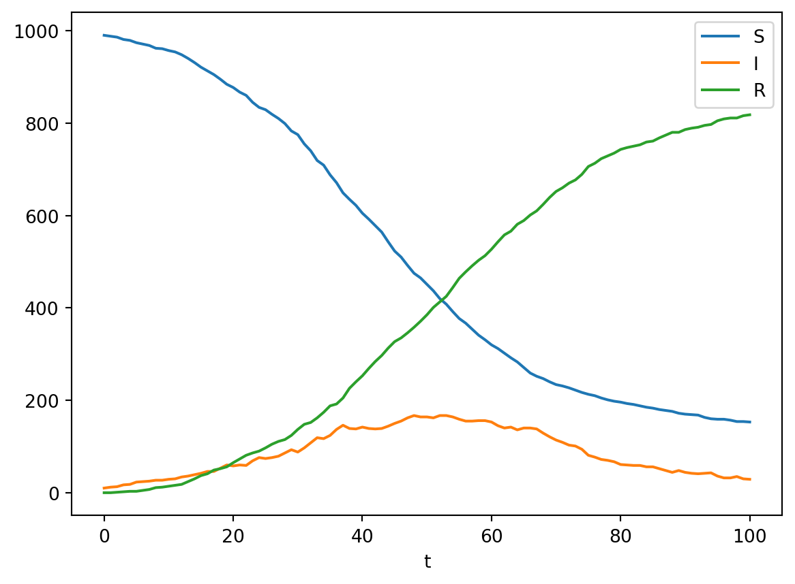

<!-- badges: start -->


[](https://ojwatson.github.io/emidm/)

# emidm


## Table of Contents

- [Installation](#installation)
- [Example Usage](#example-usage)
- [License](#license)

## Installation

``` bash
pip install git+https://github.com/OJWatson/emidm.git
```

Or

``` bash
git clone https://github.com/OJWatson/emidm.git
cd emidm
pip install .
```

## Example Usage

``` python
from emidm.sir import run_sir, run_model_with_replicates, plot_model_outputs
single = run_sir()
single.plot("t", ["S", "I", "R"])
```



## License

`emidm` is distributed under the terms of the
[MIT](https://spdx.org/licenses/MIT.html) license.
